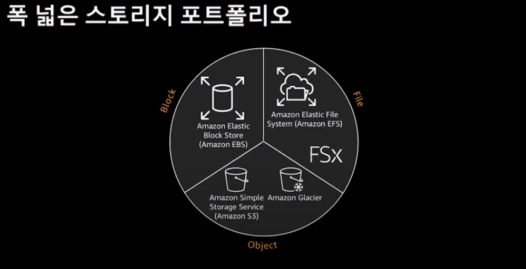
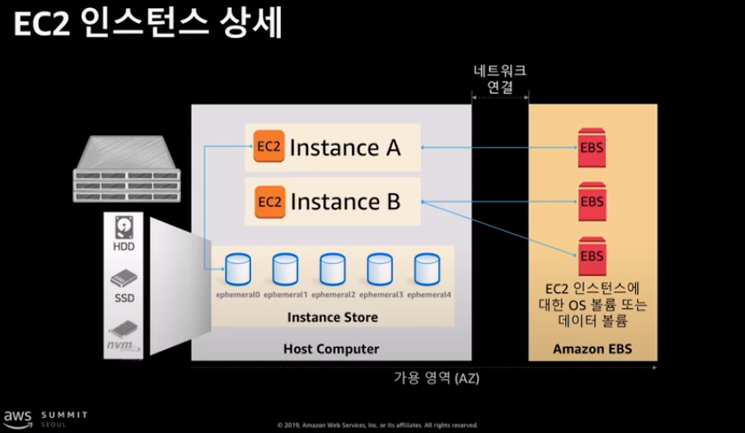
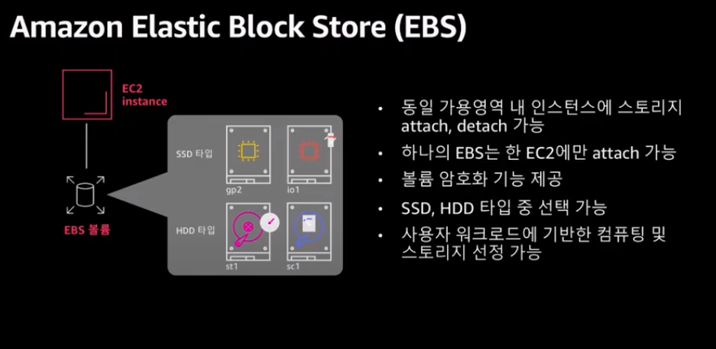

# 개요
* aws 리소스 기초 내용

# EC2
* AWS가 구축해 놓은 물리적 호스트에 올라가는 가상 서버
* 가상화 기술은 하이퍼바이저(hypervisor)

출처: aws 세미나(https://youtu.be/1zzBgCRDqeo)

* 하드웨어 사양은 aws가 미리 정의한 인스턴스 유형을 선택

출처: aws 세미나(https://youtu.be/1zzBgCRDqeo)

 

# Storage

출처: aws 세미나(https://youtu.be/1zzBgCRDqeo)

## EC2 인스턴스 불륨
* EC2를 실행하는 host불륨
* 휘발성 불륨

출처: aws 세미나(https://youtu.be/1zzBgCRDqeo)

## EBS
* block유형의 불륨으로 EC2 인스턴스에 마운트해서 사용
* 한 개의 EBS는 하나의 EC2 인스턴에스에만 마운트 가능
* ssd, hdd 선택
* 스냅샷 기능을 지원(s3에 저장)
* 목적에 따라 유형 선택

출처: aws 세미나(https://youtu.be/1zzBgCRDqeo)

## S3
* object유형의 불륨으로 마운트하지 않아도 사용이 가능
* EC2 인스턴스 뿐만 아니라 다른 리소스에서도 사용 가능(예: cloudformation, codebuild 등)

## sftp service
* aws에서 FTP 서비스를 제공

출처: aws 세미나(https://youtu.be/1zzBgCRDqeo)

## EFS
* aws가 관리하는 공유 파일 시스템(마치 NFS처럼...)
* EC2가 시작되면 자동 마운트
* 온프레미스 환경에서도 마운트해서 사용 가능

출처: aws 세미나(https://youtu.be/1zzBgCRDqeo)

## FTP service

 

# Network(VPC)

 

# 참고자료
* [1] [AWS 클라우드 핵심 서비스로 클라우드 기반 아키텍처 빠르게 구성하기 - 문종민 솔루션즈 아키텍트(AWS)](https://youtu.be/1zzBgCRDqeo)