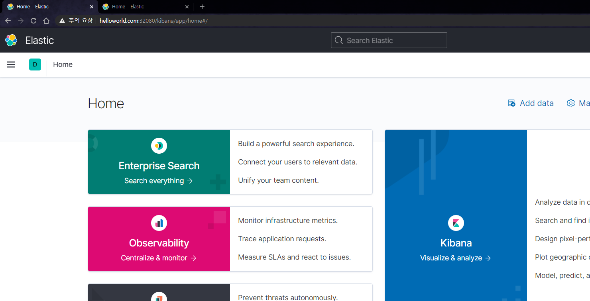

* 2021.03.15 수정중

# 1. 개요
> fluentbit 또는 fluent와 연동 시 elasticsearch, kibana버전 연동성 꼭 체크

* efk helm charts
  * elasticsearch, fluent-bit, kibana

<br>

# elasticsearch

## chart 다운
```
git clone 
```

## pv 생성(옵션)
> 동적 프로비저닝이 없을 경우 수동으로 pv 생성
> 생성한 디렉터리는 chown 1000:1000으로 소유자를 1000으로 변경 필수

```yaml
apiVersion: v1
kind: PersistentVolume
metadata:
  name: ealsticsearch-1
  namespace: efk
  labels:
    type: efk
spec:
  storageClassName: ""
  capacity:
    storage: 100Gi
  accessModes:
    - ReadWriteOnce
  hostPath:
    path: "/data/efk/elasticsearch-1"
  claimRef:
    namespace: efk
    name: elasticsearch-master-elasticsearch-master-1
```

## 커스텀 value.yaml 생성(설정)
> 아래 예제는 1개 elastic-master를 생성하는 예제
* 이미지 수정시 image와 imageTag필드 수정
```yaml
replicas: 1
minimumMasterNodes: 1
clusterHealthCheckParams: 'wait_for_status=yellow&timeout=200s'
image: "docker.elastic.co/elasticsearch/elasticsearch"
imageTag: "7.11.2"
volumeClaimTemplate:
  # storageClassName: ""
  accessModes: [ "ReadWriteOnce" ]
  resources:
    requests:
      storage: 100Gi
extraInitContainers: |
  - name: file-permissions
    image: "{{ .Values.image }}:{{ .Values.imageTag }}"
    command: ['chown', '-R', '1000:1000', '/usr/share/elasticsearch/data']
```

# kibana

## 커스텀 value.yaml 생성(설정)
* 이미지 수정시 image와 imageTag필드 수정
* (옵션) xpack 라이센스 모니터링 비활성화를 위한 환경설정
* elasticsearch 주소 설정
```yaml
image: "docker.elastic.co/kibana/kibana"
imageTag: "7.11.2"
extraEnvs:
  - name: "NODE_OPTIONS"
    value: "--max-old-space-size=1800"
  - name: "XPACK_LICENCE_MONITORING"
    value: "XPACK_MONITORING_ENABLED=false"
elasticsearchHosts: "http://elasticsearch-master.efk.svc:9200"
service:
  type: NodePort
```

------------------------------------- 구버전 (deprecated) --------------------------------
# 2. 설정
## 2.1 elasticsearch
> 설정파일 ./charts/values.yaml
* antiAffinity
* replicas
* volumeClaimTemplate
```yaml
elasticsearch:
  replicas: 2

  # Hard means that by default pods will only be scheduled if there are enough nodes for them
  # # and that they will never end up on the same node. Setting this to soft will do this "best effort"
  antiAffinity: "soft"

  volumeClaimTemplate:
    storageClassName: nfs
    accessModes: [ "ReadWriteOnce" ]
    resources:
      requests:
        storage: 10Gi
```
## 2.2 fluent-bit
> 설정파일 ./charts/charts/fluent-bit/templates/configmap.yaml
* fluent-bit.conf
```yaml
data:
  custom_parsers.conf: ""
  fluent-bit.conf: |
    [SERVICE]
        Flush 2
        Daemon Off
        Log_Level info
        Parsers_File custom_parsers.conf
        HTTP_Server On
        HTTP_Listen 0.0.0.0
        HTTP_Port 2020

    [INPUT]
        Name tail
        Path /var/log/containers/*.log
        Parser docker
        Tag kube.*
        Mem_Buf_Limit 5MB
        Skip_Long_Lines On

    [FILTER]
        Name                kubernetes
        Match               kube.*
        Kube_URL            https://kubernetes.default.svc:443
        Kube_CA_File        /var/run/secrets/kubernetes.io/serviceaccount/ca.crt
        Kube_Token_File     /var/run/secrets/kubernetes.io/serviceaccount/token
        Kube_Tag_Prefix     kube.var.log.containers.
        K8S-Logging.Parser  On
        K8S-Logging.Exclude On
        Merge_Log           On

    [OUTPUT]
        Name            es
        Match           *
        Host            {{ printf "elasticsearch-master.%s.svc" .Release.Namespace }}
        Port            9200
        HTTP_User elastic
        HTTP_Passwd changeme
        Logstash_Format On
        Replace_Dots    On
        Retry_Limit     False
        Buffer_Size     False
```

## 2.3 kibana
> 설정파일 ./charts/values.yaml
* servicetype
* ingress
  * host
  * subpath변경시
    * healthCheckPath
    * kibanaConfig
    * paths
```yaml
kibana:
  service:
    type: NodePort

  healthCheckPath: "/kibana/app/kibana"

  kibanaConfig:
    kibana.yml: |
      server.basePath: /kibana
      server.rewriteBasePath: true

  ingress:
    enabled: true
    annotations: {}

    hosts:
      - host: "helloworld.com"
        paths:
          - path: /kibana
    tls: []
```

<br>

# 3. 설치
## 3.1 설치
* efk namespace 사용
```sh
helm install -n efk -f values.yaml --create-namespace efk ./charts
```

## 3.2 접속
* ingress-controller 서비스


* kibana-ingress 확인


* kibana-Nodeport 접속


* kibana-ingress 접속


<br>

# 4. 삭제
```sh
helm uninstall -n nexus nexus
```

<br>

# 5. elastic search 기본 계정
* 계정: elastic
* 비밀번호: changeme

<br>

# 6. 참고자료
* [1] kibana external_url: https://github.com/opendistro-for-elasticsearch/opendistro-build/issues/299